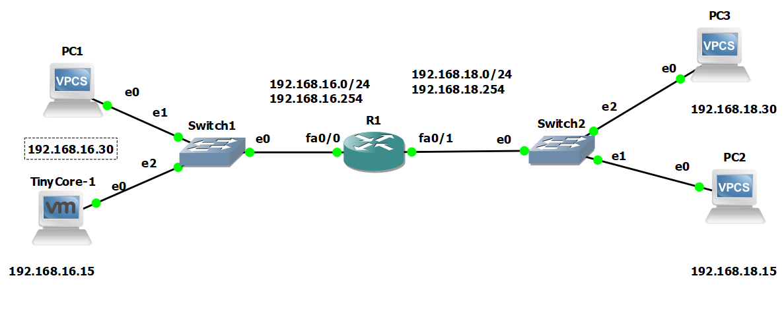

# Redes1-Práctica1_201700886
La practicá una consiste en realizar una red de computadoras pequeña usando diversas interfaces, la 
manera en la que se comprueba que la conexión sea correcta entre los equipos es con el comando **ping** hacia una ip de algú equipo de la 
red, fue implementado en **GNS3** se utilizó la imagen **C3725** como router ademas la computadora virtualizada corre en **vmware** usando **tiny core**. 
### Componentes Utilizados
Se realizó una pequeña red con:
- 1 routers(C3725)
- 2 switch
- 3 vpc
- 1 computadora virtualizada ejecutando tiny core.
### Comandos Utilizados Y Su Funcionalidad.
- ping 
>sirve para comprobar la conexión entre 2 interfaces.
- ena
>utilizado para habilitar la cofiguración del router.
- sh int bri
>utilizado para verificar las interfaces del router.
- int fa **x/n**
>sirve para configurar la interfaz, los valores posibles se encuentran con **sh int bri**.
- full-duplex
>indica que la conexión que se manejará es de tipo full-duplex.
- speed **x**
>para indicar el valor de transferencia de la información.
- ip add **CIDR** **GATEWAY**
>sirve para configurar la dirección ip de la interfaz e indicar el valor de **GATEWAY***.
- no sthudown
>para mantener la interfaz activa
- exit
>para salir del actual menú de configuración.
- write
> para escribir los cambios de configuración en el rputer.
- save
>para guardar la configuración en un **VPC**.
### Topología Utilizada En La Red
Se conectaron 2 Switch a un router principal, cada switch estaba conectado a 2 terminales.

### Configuración Individual De Cada Componente
### Glosario
